Challenge
---
DESCRIPTION
Author: Ahmad Abdillah, Systems Engineer, CSA

Difficulty: Medium

Reverse engineer the executable file to obtain the password (in the format of the flag). Use a disassembler to understand how the program works.

[crackWH_2022v1.exe](crackWH_2022v1.exe)

Approach
---
Running `file` on the program, we can see that it is a 32-bit PE32 executable for Windows.

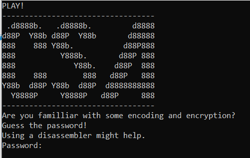

The program prompts us for a password. Let's decompile the program and check it out in IDA.

```c
int __cdecl main(int argc, const char **argv, const char **envp)
{
  int v3; // eax
  char v5[2]; // [esp+9h] [ebp-33h]
  char v6; // [esp+Bh] [ebp-31h]
  int i; // [esp+Ch] [ebp-30h]
  char Str1[12]; // [esp+10h] [ebp-2Ch] BYREF
  char Str[20]; // [esp+1Ch] [ebp-20h] BYREF
  char v10[8]; // [esp+30h] [ebp-Ch]

  if ( v3 )
    _loaddll(0);
  else
    sub_A518B0(aPlay);
  sub_A518B0(asc_A6F194);
  sub_A518B0(aD8888bD8888bD8);
  sub_A518B0(aD88pY88bD88pY8);
  sub_A518B0(a888888Y88bD88p);
  sub_A518B0(a888Y888bD88p88);
  sub_A518B0(a888Y88bD88p888);
  sub_A518B0(a888888888D88p8);
  sub_A518B0(aY88bD88pY88bD8);
  sub_A518B0(aY8888pY8888pD8);
  sub_A518B0(asc_A6F2D8);
  sub_A518B0(aAreYouFamillia);
  sub_A518B0(aGuessThePasswo);
  sub_A518B0(aUsingADisassem);
  sub_A518B0(aPassword);
  sub_A518F0(" %s", Str);
  if ( strlen(Str) != 18 )
  {
    sub_A518B0(aIncorrectPleas);
    _loaddll(0);
  }
  for ( i = 0; i < 7; ++i )
    v10[i] = Str[i];
  for ( i = 7; i < 17; ++i )
    v5[i] = Str[i];
  Str1[10] = 0;
  v6 = Str[17];
  if ( v10[0] == 87 )
  {
    if ( v10[1] == 72 )
    {
      if ( v10[2] == 50 )
      {
        if ( v10[3] == 48 )
        {
          if ( v10[4] == 50 )
          {
            if ( v10[5] == 50 )
            {
              if ( v10[6] == 123 )
              {
                if ( v6 == 125 )
                {
                  sub_A518B0(aWellDoneYouGot);
                }
                else
                {
                  sub_A518B0(aIncorrectPleas_0);
                  _loaddll(0);
                }
              }
              else
              {
                sub_A518B0(aIncorrectPleas_1);
                _loaddll(0);
              }
            }
            else
            {
              sub_A518B0(aIncorrectPleas_2);
              _loaddll(0);
            }
          }
          else
          {
            sub_A518B0(aIncorrectPleas_3);
            _loaddll(0);
          }
        }
        else
        {
          sub_A518B0(aIncorrectPleas_4);
          _loaddll(0);
        }
      }
      else
      {
        sub_A518B0(aIncorrectPleas_5);
        _loaddll(0);
      }
    }
    else
    {
      sub_A518B0(aIncorrectPleas_6);
      _loaddll(0);
    }
  }
  else
  {
    sub_A518B0(aIncorrectPleas_7);
    _loaddll(0);
  }
  Size = sub_A51100(::Str);
  dword_A70870 = (char *)malloc(Size);
  sub_A51170(::Str, (int)dword_A70870, Size);
  dword_A70870[Size] = 0;
  sub_A51330(dword_A70870, (int)Str2, off_A6F02C);
  strcmp(Str1, Str2);
  sub_A518B0(aCongratulation);
  sub_A518B0(aTheFlagIsS);
  sub_A518B0(aWoohooYouClear);
  return 0;
}
```

The IDA decompilation present us main as shown above.

```c
if ( strlen(Str) != 18 )
{
  sub_A518B0(aIncorrectPleas);
  _loaddll(0);
}
```

After taking in our input, the program will first check if the length of our input is 18. This means the password will be a length 18 string.

```c
if ( v10[0] == 87 )
{
  if ( v10[1] == 72 )
  {
    if ( v10[2] == 50 )
    {
      if ( v10[3] == 48 )
      {
        if ( v10[4] == 50 )
        {
          if ( v10[5] == 50 )
          {
            if ( v10[6] == 123 )
            {
              if ( v6 == 125 )
              {
                sub_A518B0(aWellDoneYouGot);
              }
              else
              {
                sub_A518B0(aIncorrectPleas_0);
                _loaddll(0);
              }
            }
            else
            {
              sub_A518B0(aIncorrectPleas_1);
              _loaddll(0);
            }
          }
          else
          {
            sub_A518B0(aIncorrectPleas_2);
            _loaddll(0);
          }
        }
        else
        {
          sub_A518B0(aIncorrectPleas_3);
          _loaddll(0);
        }
      }
      else
      {
        sub_A518B0(aIncorrectPleas_4);
        _loaddll(0);
      }
    }
    else
    {
      sub_A518B0(aIncorrectPleas_5);
      _loaddll(0);
    }
  }
  else
  {
    sub_A518B0(aIncorrectPleas_6);
    _loaddll(0);
  }
}
```
The next part of the code checks individual characters of the password. As you can see, the first 6 character of the input is checked against some numbers which represents **WH2022{** after converting to ascii.

The last character is then checked to be **}**.

So now we know the password would be `WH2022{XXXXXXXXXX}` which is 18 character long and where `XXXXXXXXXX` is the flag.

At this point, the rest of the code that generates the flag is too complicated and I have no interest in reversing it manually.

If we skip the part of the code that produces the flag, we arrive here:

```c
strcmp(Str1, Str2);
sub_A518B0(aCongratulation);
sub_A518B0(aTheFlagIsS);
sub_A518B0(aWoohooYouClear);
```

It should be pretty straightforward to figure out that this part of the code compares our input against the flag generated by the program.

If we could somehow just view what both `Str1` and `Str2` contain, we can probably find our flag.

Debugging
---
I will use windbg for this writeup. This writeup will also aim to teach the basics of windbg.

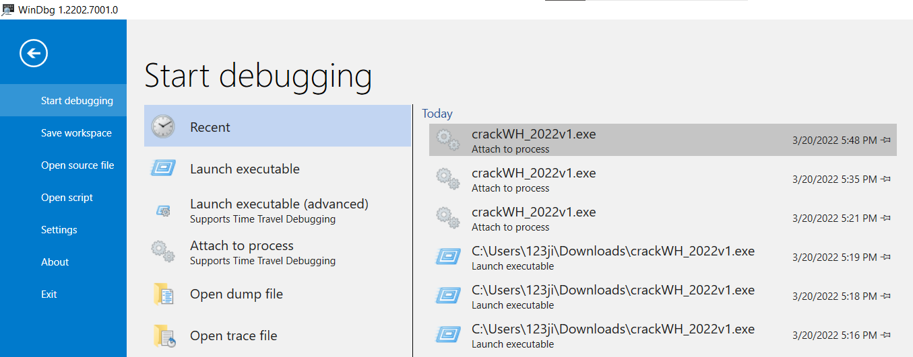

At startup, we can either choose to launch the program or attach it when it's running midway.


#### Attempt 1

By default, I would usually launch the executable from windbg so I can directly start debugging from the very beginning. So let's get started.

As you can see in the screenshot above, I have a few windows open by default.

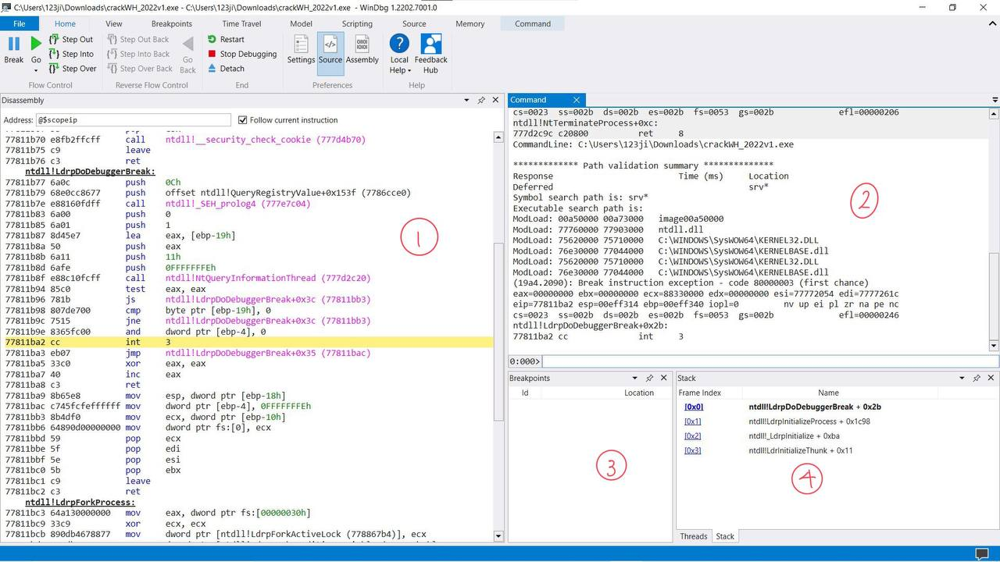

1. Disassembly
2. WinDBG Command Prompt
3. Breakpoints
4. Call Stack

By default, our WinDBG starts off at some ulu instruction prior to the execution of our actual code.

By running `x *!` in our command prompt, we can list all the modules loaded in the program.

```js
0:000> x *!
start    end        module name
00a50000 00a73000   crackWH_2022v1 C (no symbols)           
75620000 75710000   KERNEL32   (deferred)             
76e30000 77044000   KERNELBASE   (deferred)             
77760000 77903000   ntdll      (pdb symbols)          C:\ProgramData\Dbg\sym\wntdll.pdb\433094D2BBFF99FD8B094875FD33DF661\wntdll.pdb
```

As you can see, there are a few modules loaded, the only relevant one will be the **crackWh_2022v1** which contains the stuff in our program.

As you can see, the program mapping starts at `0xa50000`. In order to help us to match the addresses to instructions in our program easily, we can simply rebase our `IDA` address to `0xa50000` so that the addresses shown in IDA is identical to the ones shown in our debugger.

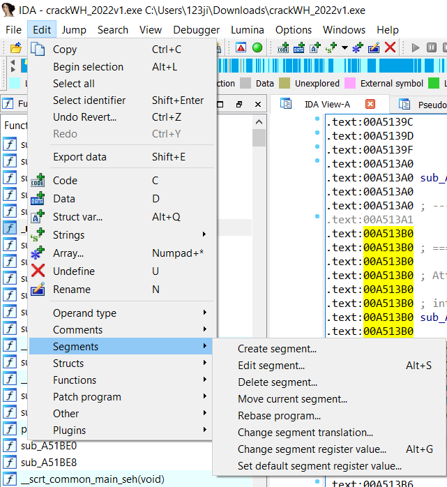

Select **Rebase program...** and set the base address to `0xa50000`.

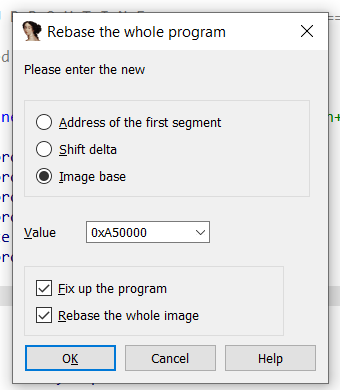

Now if you go to the main function in our IDA, you can see that it starts at address **0xa51440**.

We will now go back to our debugger and set a **breakpoint** there by running `bp 0xa51440` in our WinDBG.

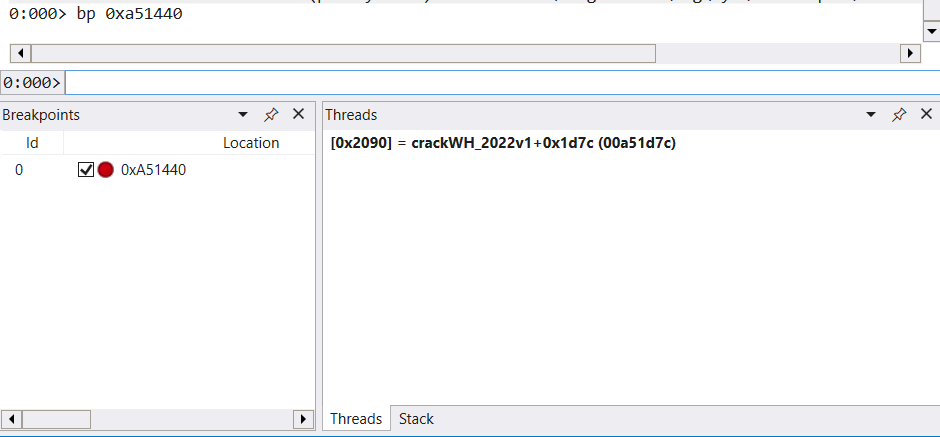

Next we will run `g` to continue the program execution until our breakpoint.

We will arrive in **main**.

However after running `p` a few times which goes to the next instruction, we will find that our program ends execution even before running the main bulk of the program.

#### Problem 1

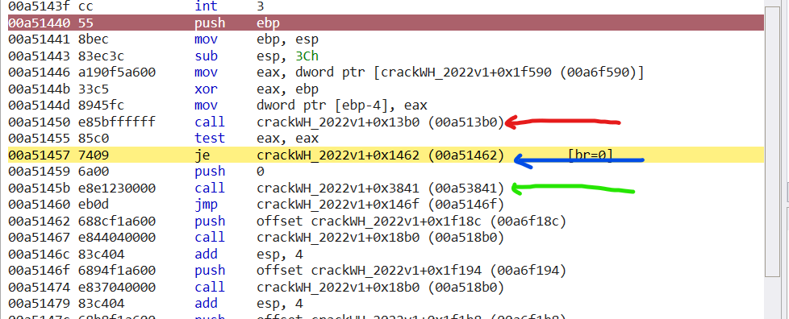

It appears that the instruction at the red line seems to call some form of check that returns `True` or `False`.

At the blue line, it will jump to the program if the returned value is `False`, otherwise it will proceed on to the green line and call a function that ends the execution of the program.

This appears to be some sort of anti-debugging check. In hindsight, the red line calls the [**IsDebuggerPresent**](https://docs.microsoft.com/en-us/windows/win32/api/debugapi/nf-debugapi-isdebuggerpresent) function which checks if a debugger is present and exits if so.

However we can easily bypass this.

One way is to modify the bytes of the program to change the `74 09` opcode to `75 09` which changes the instruction from `je` to `jne`. This reverses the logic to make the program run when debugger is present vice versa.

### Solution
However, in this demonstration, we will just do it the simpler way - by attaching the debugger an already running process, effectively making the **IsDebuggerPresent** clause false as the debugger is only attached after the check has been done.

We will stop debugging the program and run it independently without the debugger.


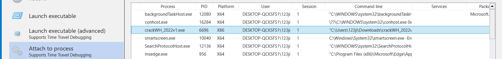

While leaving the program to run in the background, we will attach our WinDBG to the process.

Instantly, the first thing we see after attaching to our process is an unfamiliar `ntdll!DbgBreakpoint` function. This is actually a function that is called in a separate thread from the program when you connect your debugger.

We can list our thread with the following `~` commands:

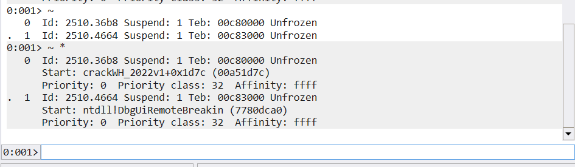

Naturally our only concern is the program itself, so we will change back to debug thread 0 with the `~0s` command.

This places us at a **mtdll!NtReadFile** function.

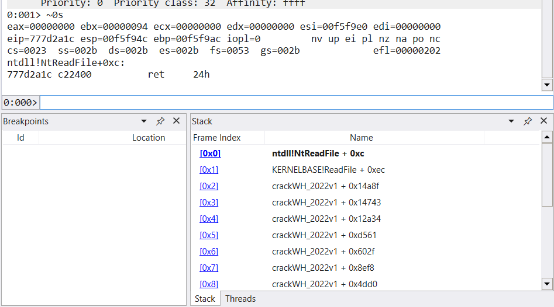

This is because the program is still trying to read our input. We will submit `WH2022{XXXXXXXXXX}` as the password so we pass the `strlen` and `WH2022{}` checks.

Now we want to get to the main stuff, our main objective is still to find the flag which is being compared in a `strcmp` function.

After submitting our 'password' to the program, we will want to go back to our previous functions on the call stack as shown in the screenshot above.

In order to do so, we can step out of our current function with the `gu` aka `go until` command.

> p.s. if this sends you back to the debugger thread, you may want to run a single instruction with the `p` command before changing to the program thread and stepping out.

Looking at our IDA, we can see that the `strcmp` instruction is at address `0A517BC`. We will set a breakpoint there in WinDBG with `bp 0A517BC`, and then use the `g` command to continue execution until it hits the breakpoint.

As we know, `strcmp` takes 2 arguments, one of which should be our input and the other one is the flag.

In a 32-bit program, arguments to a function are stored on the stack prior to calling the function.

This means that by the time we reached our `call strcmp` instruction, our 2 arguments are on the stack. We can examine these 2 addresses with the command `dd /c1 esp L2`.

- dd — dump dword (4bytes)
- /c1 — 1 column
- esp — from esp
- L2 — with 2 lines

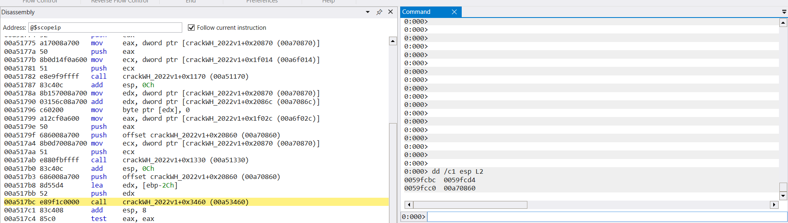

The 2 values printed are character pointers to the 2 strings being compared. We can print them both with the `da - dump ascii` command.

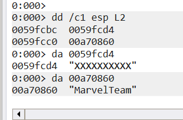

And thus our flag is `WH2022{MarvelTeam}`.

## Conclusion
---

This was my first time using WinDBG and I really enjoyed it :)

Hope you picked something up from this little writeup!!
