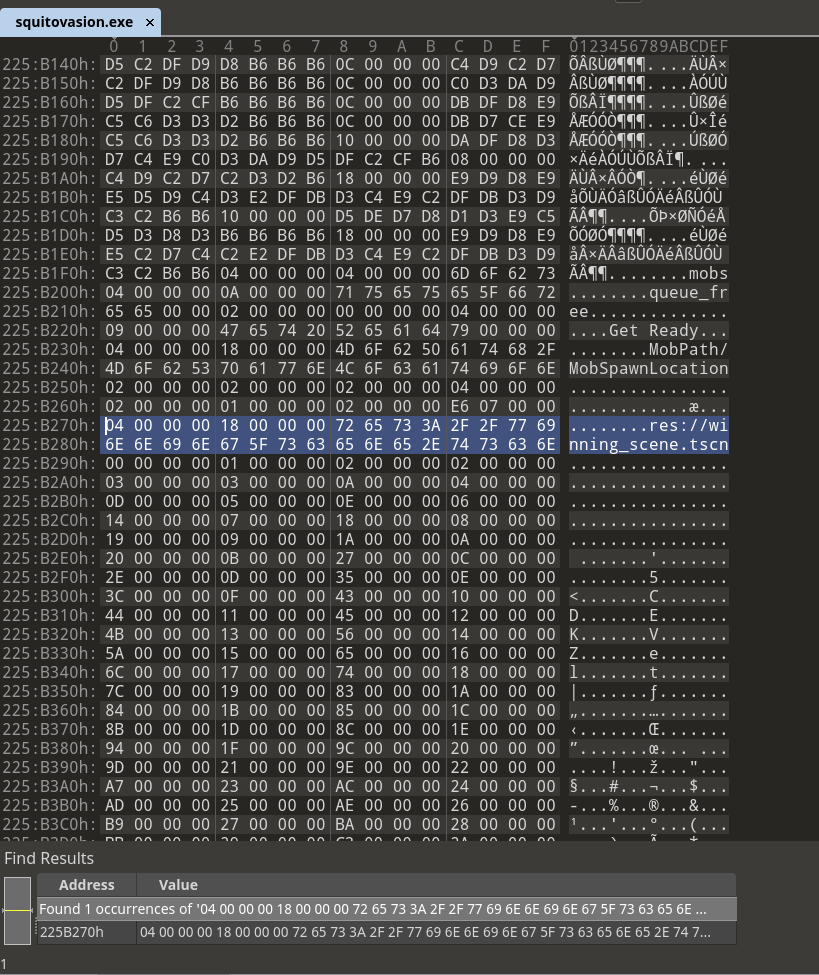

# Challenge Description
Author: KS, Chun

Difficulty: Hard

Invasion alert!! Incoming APOCALYPSE squito minions!!!

Survive, RE, or just try your best to stay alive. Implement your winning strategy and defeat the invasion!

This challenge is best done on a Windows platform or a VM with Windows installed. You can execute the binary in a Windows VM as a starting point.

This game is developed on a game engine that is completely free and open-source.

The flag you will find in the challenge follows this format: WH2022{\*}

[squitovasion.exe](squitovasion.exe)

# Walkthrough

#### Checking out the program

We are given a exe file which immediately stands out as a godot executable if viewed on windows, or can also be identified from the brief godot logo when running the program.


This game is essentially a squid running around and dodging dangerous octopuses until we win.

We can also find the godot engine version used for this program by running it with the `--version` parameter.


#### Employing tools TO REVERSE ENGINEER THE GODOT EXE

With the knowledge that this is a godot executable, we probably would realize that decompiling it in IDA or Ghidra is not a very smart idea as the code is probably heavily obfuscated with the godot engine.

With some searching, we can find a **[godot decompiler](https://github.com/bruvzg/gdsdecomp)** online which may help us in reversing this program. In the releases of this github repository, we find the standalone binary for this decompiler which we can download.


Running the binary, we actually notice that it is able to decompile **GDC** files, but we don't have any GDC files of such. Looks like we have to find a way to unpack our executable.

With some googling, we can find [godotdec](https://github.com/Bioruebe/godotdec) which is an unpacker for godot executables. We can download the standalone binary from the releases and run it.


Now we have the unpacked files from our exe. 

Let's decompile Main.gdc to get the **Main.gd** file so we can actually read what is going on in the godot code.


Because the version of the godot engine used is 3.2.3, we will use the script bytecode version of 3.2.0 to decompile.

#### How to win?

After decompiling the GDC, we have our godot source code here:

```godot
extends Node

export (PackedScene) var mob_scene
var score

func _ready():
	randomize()


func game_over():
	$ScoreTimer.stop()
	$MobTimer.stop()
	$HUD.show_game_over()
	$Music.stop()
	$DeathSound.play()


func new_game():
	get_tree().call_group("mobs", "queue_free")
	score = 0
	$Player.start($StartPosition.position)
	$StartTimer.start()
	$HUD.update_score(score)
	$HUD.show_message("Get Ready")
	$Music.play()


func _on_MobTimer_timeout():
	
	var mob_spawn_location = get_node("MobPath/MobSpawnLocation")
	mob_spawn_location.offset = randi()

	var mob = mob_scene.instance()
	add_child(mob)
	
	var direction = mob_spawn_location.rotation + PI / 2

	mob.position = mob_spawn_location.position

	direction += rand_range( - PI / 4, PI / 4)
	mob.rotation = direction

	var velocity = Vector2(rand_range(mob.min_speed, mob.max_speed), 0)
	mob.linear_velocity = velocity.rotated(direction)


func _on_ScoreTimer_timeout():
	score += 1
	$HUD.update_score(score)
	if score > 2022:
		get_tree().change_scene("res://winning_scene.tscn")


func _on_StartTimer_timeout():
	$MobTimer.start()
	$ScoreTimer.start()
```

The interesting part here is 
```
	if score > 2022:
		get_tree().change_scene("res://winning_scene.tscn")
```

If we could somehow patch the binary to make winning score much smaller, i.e. 1 instead of 2022, we can easily win this game.

However how do we do that? We will modify the winning score, then recompile our Main.gd and compare the binary differences between the original and modified Main.gd to see what was changed.

Next, we will find a sequence of unique bytes that we can searchup for in the squitovasion.exe, and modify the bytes to change the winning score of the exe.

Let's try it out!!

#### reversing in progress...

We will first modify Main.gd to be as such:

```
extends Node

export (PackedScene) var mob_scene
var score

func _ready():
	randomize()


func game_over():
	$ScoreTimer.stop()
	$MobTimer.stop()
	$HUD.show_game_over()
	$Music.stop()
	$DeathSound.play()


func new_game():
	get_tree().call_group("mobs", "queue_free")
	score = 0
	$Player.start($StartPosition.position)
	$StartTimer.start()
	$HUD.update_score(score)
	$HUD.show_message("Get Ready")
	$Music.play()


func _on_MobTimer_timeout():
	
	var mob_spawn_location = get_node("MobPath/MobSpawnLocation")
	mob_spawn_location.offset = randi()

	var mob = mob_scene.instance()
	add_child(mob)
	
	var direction = mob_spawn_location.rotation + PI / 2

	mob.position = mob_spawn_location.position

	direction += rand_range( - PI / 4, PI / 4)
	mob.rotation = direction

	var velocity = Vector2(rand_range(mob.min_speed, mob.max_speed), 0)
	mob.linear_velocity = velocity.rotated(direction)


func _on_ScoreTimer_timeout():
	score += 1
	$HUD.update_score(score)
	if score > 5:
		get_tree().change_scene("res://winning_scene.tscn")


func _on_StartTimer_timeout():
	$MobTimer.start()
	$ScoreTimer.start()
```

Then using our go dot decompiler tool, we will recompile this into Main.gdc.

We will then open both our new and old Main.gdc into a hex editor i.e. 010 editor.

By comparign the 2 binary file, we can find where the bytes differ when the score is changed from 2022 to 5.

On the right, we have 0x07E6 which is 2022 in decimal and on the right we have 0x5 which is 5 in decimal.

Let's extract the next 0x20 bytes after the line to obtain our unique bytes that we can searchup in our squitovasion.exe to find this portion of bytes that define the winning score.

```
04 00 00 00 18 00 00 00 72 65 73 3A 2F 2F 77 69 6E 6E 69 6E 67 5F 73 63 65 6E 65 2E 74 73 63 6E
```

Then we open our squitovasion.exe in a hex editor and search for the 0x20 bytes.



Found it! Now we can change the 0x07E6 right above these 20 bytes to 0x0005 to set the winning score to 5 and then play the game !!

As soon as we hit a score of 5...


## Alternative solution

Alternatively, there was another interesting **GDC** file that was obtained when unpacking our exe which was **winning_scene.gdc**.

If we decompile it and look at the godot code for this winning_scene, we will get the following code:

```javascript
extends Node2D


func _ready():
	var bzflm8t7pk = File.new()
	var um7d1tehim = Image.new()
	var vxsu1vsf1a = Marshalls.base64_to_utf8("cmVzOi8vQVNTRVQvbXVzaWNfMC5kYXQ=")
	var _hry1ycoy92 = bzflm8t7pk.open(vxsu1vsf1a, File.READ)
	var gndwrdgp3k = bzflm8t7pk.get_len()
	var po9vp5pb8m = zgtb8f0x4j(bzflm8t7pk.get_buffer(gndwrdgp3k))
	var _rpcno7pskw = um7d1tehim.load_png_from_buffer(po9vp5pb8m)
	var kfmwx7av40 = ImageTexture.new()
	kfmwx7av40.create_from_image(um7d1tehim)
	
	
	$TextureRect.texture = kfmwx7av40
	bzflm8t7pk.close()
	um7d1tehim.lock()
	
func zgtb8f0x4j(zthju4fxqf):
	var _kvb1l4znrq = [225, 16, 208, 13, 226, 152, 2]
	var kvb1l4znrq = [30, 117, 208, 192, 255, 238, 71, 197, 23, 0]
	var ne0lmuk4l3 = len(zthju4fxqf)
	var zhgji4f223 = PoolByteArray()
	for i in range(kvb1l4znrq[9], ne0lmuk4l3, _kvb1l4znrq[6]):
		var fnjfiydk1c = zthju4fxqf[i] ^ kvb1l4znrq[1] ^ kvb1l4znrq[4]
		var vxsu1vsf1a = fnjfiydk1c ^ _kvb1l4znrq[1] ^ _kvb1l4znrq[2]
		var ce0m8cvumg = zthju4fxqf[i + 1] ^ kvb1l4znrq[0] ^ kvb1l4znrq[3]
		var f8ol2q11j2 = ce0m8cvumg ^ kvb1l4znrq[5] ^ kvb1l4znrq[8]
		var j2ciixrw1n = vxsu1vsf1a ^ kvb1l4znrq[7] ^ _kvb1l4znrq[5]
		var wkx3tq8ati = f8ol2q11j2 ^ _kvb1l4znrq[4]
		zhgji4f223.append(wkx3tq8ati)
		zhgji4f223.append(j2ciixrw1n)
	return zhgji4f223
	
```

ohno this looks like some really obfuscated code... but it just means that we are at the right place >:)

```javascript
var vxsu1vsf1a = Marshalls.base64_to_utf8("cmVzOi8vQVNTRVQvbXVzaWNfMC5kYXQ=")
```

If we base64 decode this string, it translates to `res://ASSET/music_0.dat`. Oh how sneaky... 

It seems like `ASSET/music_0.dat` is our encrypted flag image, and the function defined in the code is the decryption function. It does a bunch of xor to reveal the flag png.

I also noticed that the godot code has very similar syntax with python code, so I could possibly to just modify some stuff here and throw it into python.

```python
def zgtb8f0x4j(zthju4fxqf):
    _kvb1l4znrq = [225, 16, 208, 13, 226, 152, 2]
    kvb1l4znrq = [30, 117, 208, 192, 255, 238, 71, 197, 23, 0]
    ne0lmuk4l3 = len(zthju4fxqf)

	# i inserted a few lines to convert our encrypted flag into its unicode value
    stuff = zthju4fxqf # encrypted flag
    zthju4fxqf = []
    for i in stuff:
        zthju4fxqf.append(ord(i))

    zhgji4f223 = []
    for i in range(kvb1l4znrq[9], ne0lmuk4l3, _kvb1l4znrq[6]):
        fnjfiydk1c = zthju4fxqf[i] ^ kvb1l4znrq[1] ^ kvb1l4znrq[4]
        vxsu1vsf1a = fnjfiydk1c ^ _kvb1l4znrq[1] ^ _kvb1l4znrq[2]
        ce0m8cvumg = zthju4fxqf[i + 1] ^ kvb1l4znrq[0] ^ kvb1l4znrq[3]
        f8ol2q11j2 = ce0m8cvumg ^ kvb1l4znrq[5] ^ kvb1l4znrq[8]
        j2ciixrw1n = vxsu1vsf1a ^ kvb1l4znrq[7] ^ _kvb1l4znrq[5]
        wkx3tq8ati = f8ol2q11j2 ^ _kvb1l4znrq[4]
        zhgji4f223.append(wkx3tq8ati)
        zhgji4f223.append(j2ciixrw1n)
    return zhgji4f223
```

Now as for the rest of the script...

```python
f = open('./squitovasion/ASSET/music_0.dat', 'rb').read()

out = open('./flag.png', 'w+')
out.write(''.join(map(chr, zgtb8f0x4j(f))))
out.close()
```

and voila, out comes our flag :)


